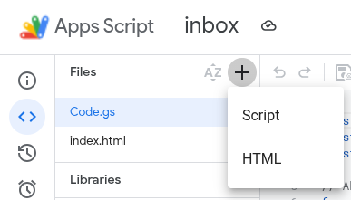

# Cara membuat Form Surat Masuk dengan Fungsi CRUD di Google Apps Script

Berikut adalah langkah - langkah membuat form surat masuk dengan Google Sheets sebagai database, Google Drive sebagai penyimpanan surat - surat dalam format PDF, dan Google Apps Script sebagai hosting dan backend nya.

1. Buat Google Sheets baru

   - pertama, pergi ke [Google Sheets](https://docs.google.com/spreadsheets)
   - ganti nama menjadi Surat Masuk, atau apalah sesuai dengan keinginanmu
   - masukkan header di baris pertama
     - id, penerima, no urut, asal surat, nomor surat, tgl surat, tgl terima surat, perihal, disposisi, link

2. Buat Google Apps script

   - klik Extentions > Apps Script
   - ganti nama projek Apps Script sesuai dengan keinginan kalian
   - sekarang delete fungsi yang ada di tab code.g
   - kemudian salin dan tempelkan kode di code.gs

3. Buat file index.html di Google Apps Script
   

   - kemudian salin dan tempel kode di index.html

4. Simpan projek Google Apps Script dengan cara ctrl + s di keyboard
5. Setelah itu deploy Google Apps Script
   - klik tombol Deploy di kanan atas
   - pilih Deployment Baru / New Deployment
   - kemudian klik icon gear di kiri atas dan pilih Web App
   - isi deskripsi
   - pilih eksekusi sebagai / execute as Email kamu
   - pilih yang anyone dan klik Deploy
   - nanti akan diarahkan ke email kamu
   - jika ada tulisan unsafe, klik saja dan lanjutkan
   - klik next hingga muncul tulisan Web App Url
   - klik link yang Web App Url
6. WebApp sudah bisa digunakan
